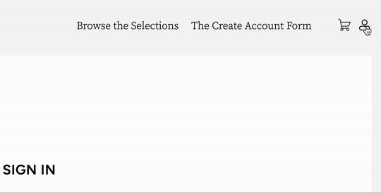
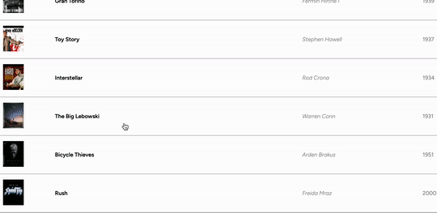
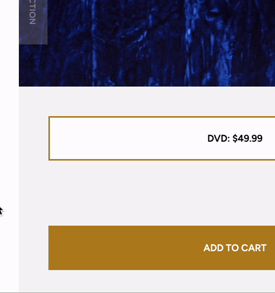
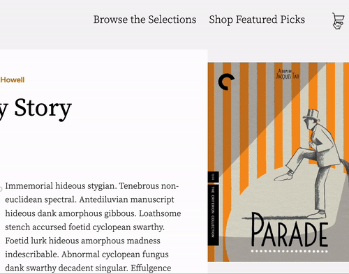

# Sublimus Selections

Sublimus Selections is a fullstack clone of the Criterion Collection. The intent is mimic the functionalities of the original site like user account creation and authorization. The store contains an index of available products and a shopping cart that may be added to, or removed from.

## Live Link

[Sublimus Selections](https://sublimus.onrender.com/)

## Technologies

- Ruby on Rails
- React.js
- Node.js with webpack, npm and babel
- Redux for React
- HTML
- CSS and SCSS
- PostgreSQL
- Render for hosting

## Features

- Create an account and login/logout, restricting access to features

    

- Browse product listings

    

- Add Items to a shopping cart, update the items and remove them as desired

    

    

- Video loop splash page

    

## Attributions

- Icons from Icons8.com, <a href="https://www.flaticon.com/free-icons/linkedin" title="linkedin icons">Smashicons,</a> <a href="https://www.flaticon.com/free-icons/github" title="github icons">Pixel perfect,</a> <a href="https://www.flaticon.com/free-icons/email" title="email icons">Ilham Fitrotul Hayat</a>
- Logo by <a href="https://commons.wikimedia.org/wiki/File:The_Criterion_Collection_Logo.svg" title="Criterion Logo">Fleshgrinder</a>
- Image and video assets from Criterion, (<https://www.criterion.com/>)
- Fonts from Google fonts
